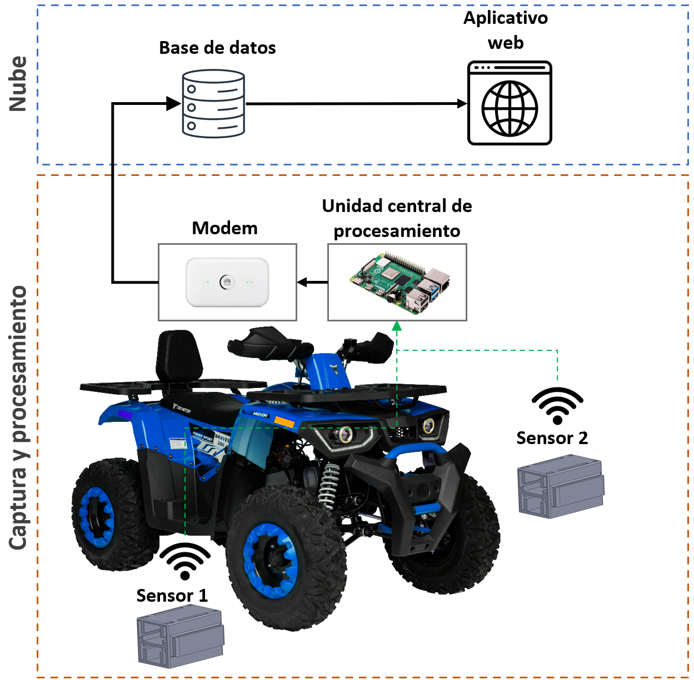
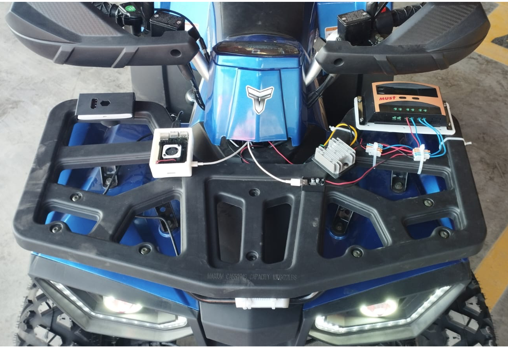

## Ejercicio CiberKillChain - Ataque

### Alumno : Kevin Guerra Huamán

### Descripción del trabajo

<table>
  <tr>
    <td align="center">
       
      <em>Propuesta de proyecto</em>
    </td>
    <td align="center">
       
      <em>Propuesta de implementación</em>
    </td>
  </tr>
</table>

El proyecto propone utilizar sensores de vibración, integrados con tecnologías IoT y algoritmos de inteligencia artificial, para monitorear baches de manera eficiente y a menor costo que soluciones tradicionales como LiDAR o cámaras de alta velocidad. Los sensores, instalados en zonas sensibles al movimiento de los vehículos, recopilan datos sobre la forma y profundidad de los baches, que son procesados por una unidad central y transmitidos a la nube para su análisis y visualización remota. El enfoque en inteligencia artificial permite superar la variabilidad del entorno y el ruido del vehículo, mientras que la arquitectura IoT garantiza una conectividad robusta y segura para la gestión y transmisión de los datos.

### Objetivo

- Obtener las credenciales de acceso a los servicios en la nube para infiltrarse en el sistema de almacenamiento de datos y vender o alterar la información monitoreada.

### Etapas de CiberKillChain

1. 🔍 **Reconnaissance**  
   - Técnica: [T1598 - Phishing for Information](https://attack.mitre.org/techniques/T1598/).  
   *Descripción*: Se obtiene información sobre los dispositivos del proyecto, identificando principalmente la versión y tipo del computador de placa reducida.

2. 🛠️ **Weaponization**  
   - Técnica: [T1587 – Develop Capabilities](https://attack.mitre.org/techniques/T1587/).  
   *Descripción*: Con la información recolectada se configura los scripts maliciosos para una ejecución rápida a través de puertos USB.

3. 📦 **Delivery**  
   - Técnica: [T1105 - Ingress Tool Transfer](https://attack.mitre.org/techniques/T1105/).  
   *Descripción*: Los scripts maliciosos son preparados en herramientas de hacking como Flipper Zero o USB configuradas como BadUSB, aprovechando la disponibilidad física de los puertos USB.

4. 🚀 **Exploitation**
   - Técnica: [T1059 - Command and Scripting Interpreter](https://attack.mitre.org/techniques/T1059/).  
   *Descripción*: Al conectar el dispositivo USB, los scripts maliciosos se ejecutan automáticamente mediante intérpretes de comandos como Bash o Python, comprometiendo el sistema sin intervención del usuario.

5. 🖥️ **Installation**  
   - Técnica: [T1547 - Boot or Logon Autostart Execution](https://attack.mitre.org/techniques/T1547/).  
   *Descripción*: Se instalan mecanismos de persistencia que aseguran la ejecución automática de los scripts maliciosos cada vez que el sistema se reinicia o inicia sesión. 

6. 🎛️ **Command and Control**  
   - Técnica: [T1571 - Non-Standard Port](https://attack.mitre.org/techniques/T1571/).  
   *Descripción*: A través de puertos no estándar se establece una conexión a servidores externos. La conexion permite pasar desapercibido y dificuta la detección.

7. 🎯 **Actions on Objectives**  
   - Técnica: [T1041 - Exfiltration Over C2 Channel](https://attack.mitre.org/techniques/T1041/).  
   *Descripción*: Los archivos críticos, incluyendo las llaves de seguridad almacenadas en el Raspberry Pi, son comprimidos y exfiltrados al servidor externo a través del canal descrito en comando y control, minimizando el tiempo de transmisión y el riesgo de detección